# Site Architecture & Content Sitemap

This diagram provides a visual representation of all content and categories in the repository, showing how pages are connected and organized within the site's structure.

## Site Structure Diagram

```mermaid
graph TB
    %% Root
    Home[🏠 Home Page<br/>barbhs.com]

    %% Main Navigation
    Home --> Projects[📊 Projects]
    Home --> Thinking[💭 Thinking]
    Home --> Resources[📚 Resources]
    Home --> Journey[🚶 My Journey]
    Home --> Contact[📧 Contact]
    Home --> Blog[📝 Blog Archive]
    Home --> About[👤 About]

    %% Projects Collection (4 items)
    Projects --> P1[Self-Hosted Workout Intelligence<br/>Active]
    Projects --> P2[Beehive Analytics Platform<br/>WIP]
    Projects --> P3[Convoscope: Conversational AI<br/>Active]
    Projects --> P4[Knowledge Network Mapping<br/>WIP]

    %% Thinking Collection (4 items)
    Thinking --> T1[📌 Bees, Graphs & Governance<br/>Foundational]
    Thinking --> T2[📌 7±2 is Everywhere: Chunking<br/>Cognitive Science]
    Thinking --> T3[📌 Vision & Data Viz<br/>Decision-Making]
    Thinking --> T4[RAG Without the Theater<br/>AI Governance]

    %% Resources Collection (6 items)
    Resources --> R1[Vision & Perception Cheatsheet<br/>PDF]
    Resources --> R2[Bridge to Web Apps<br/>Streamlit/Plotly Guide]
    Resources --> R3[Executive Brief Template<br/>Beginner]
    Resources --> R4[Dataset & Prompt Cards<br/>Intermediate]
    Resources --> R5[Project Starter Kit<br/>Data Science]
    Resources --> R6[Interactive Web Apps Guide<br/>PDF]

    %% My Journey
    Journey --> J1[Career Timeline<br/>Vision Science → Data Systems]

    %% Additional Static Pages
    Home --> Portfolio[🗂️ Portfolio<br/>Legacy Collection]
    Home --> Experience[💼 Experience]
    Home --> Research[🔬 Research]
    Home --> Gallery[🎨 Gallery]

    %% Portfolio (Legacy - 6 items)
    Portfolio --> PF1[Build Your Own Webpage]
    Portfolio --> PF2[IoT Real-Time Viz Workflow]
    Portfolio --> PF3[Academic Citation Networks]
    Portfolio --> PF4[CareerCraft Job Assistant]
    Portfolio --> PF5[Personal Workout Analytics]
    Portfolio --> PF6[CodeConvo LLM Interface]

    %% Experience Page Elements
    Experience --> EX1[Filterable Roles<br/>Interactive Timeline]

    %% Research Page Elements
    Research --> RES1[📄 Academic Papers<br/>4 publications]
    Research --> RES2[📋 Conference Posters<br/>8 posters]

    %% Gallery
    Gallery --> G1[Midjourney AI Art<br/>3 galleries]

    %% Blog Structure
    Blog --> BP1[📂 Website Building Series<br/>4 parts]
    Blog --> BP2[📂 Sensor Fleet Series<br/>7 parts: IoT/MQTT/Kafka]
    Blog --> BP3[Technical Posts<br/>Mermaid, AWS, Git]
    Blog --> Archives[Archives<br/>Tags & Categories]

    %% Archives
    Archives --> TagArchive[Tag Archive]
    Archives --> CategoryArchive[Category Archive]

    %% Styling
    classDef collection fill:#e1f5ff,stroke:#0077b6,stroke-width:2px
    classDef legacy fill:#fff3cd,stroke:#856404,stroke-width:2px
    classDef pinned fill:#d1e7dd,stroke:#0a3622,stroke-width:2px
    classDef wip fill:#f8d7da,stroke:#842029,stroke-width:2px

    class Projects,Thinking,Resources collection
    class Portfolio legacy
    class T1,T2,T3 pinned
    class P2,P4 wip
```



## Content Hierarchy Overview

### Primary Navigation (Main Menu)
1. **Projects** → `/projects/` - Data products & AI systems (4 active/WIP items)
2. **Thinking** → `/thinking/` - Essays on cognition, data, AI (4 items, 3 pinned)
3. **Resources** → `/resources/` - Templates & guides (6 downloadable items)
4. **My Journey** → `/my-journey/` - Career narrative & timeline
5. **Contact** → Social links & email

### Secondary Pages (Footer/Utility)
- **Blog** → `/blog/` - Post archive with pagination (16 posts)
- **Portfolio** → `/portfolio/` - Legacy project showcase (6 items, being migrated)
- **Experience** → `/experience/` - Filterable professional roles
- **Research** → `/research/` - Academic publications (4 papers, 8 posters)
- **About** → `/about/` - Professional bio & highlights
- **Gallery** → `/gallery/` - Midjourney AI art collections

## Site Organization Principles

### Content Migration Strategy
- **Modern Collections**: Projects, Thinking, Resources (current focus)
- **Legacy Collection**: Portfolio (being phased out, content migrating to Projects)
- **Static Pages**: Experience, Research, About, Gallery (supplementary content)

### Content Themes
1. **Vision & Perception Science** - Academic research foundation (MIT PhD)
2. **Data Systems & Knowledge Graphs** - Technical architecture
3. **AI/NLP Integration & Governance** - Modern AI practices
4. **Data Products & Analytics** - User-centered design
5. **Technical Skills & DevOps** - Implementation guides

### URL Structure
```
/                           → Home page
/projects/                  → Projects collection index
/projects/{title}/          → Individual project pages
/thinking/                  → Thinking collection index
/thinking/{title}/          → Individual essays
/resources/                 → Resources collection index
/resources/{title}/         → Individual resource pages
/my-journey/                → Career timeline
/portfolio/                 → Legacy portfolio grid
/portfolio/{title}/         → Legacy project pages
/experience/                → Professional experience
/research/                  → Academic publications
/about/                     → About page
/blog/                      → Blog archive
/blog/page/{n}/             → Paginated blog (3 per page)
/{year}/{month}/{title}/    → Individual blog posts
/tags/                      → Tag archive
/categories/                → Category archive
/gallery/                   → AI art galleries
```

## Target Audiences
- Data scientists transitioning to product roles
- Technical professionals building personal brands
- Teams implementing AI governance practices
- Career-changers documenting learning journeys

## Technical Implementation
- **Theme**: Minimal Mistakes v4.27.1 (Remote theme)
- **Hosting**: GitHub Pages with custom domain (barbhs.com)
- **Collections**: 3 modern + 1 legacy defined in `_config.yml`
- **Navigation**: Masthead menu via `_data/navigation.yml`
- **Content**: 49+ markdown files across collections and posts
- **Features**: Search (Lunr.js), Analytics (Google), Breadcrumbs, Responsive design

---

*Last updated: 2025-11-21*
*Generated for: dagny099.github.io repository*
