# Scripts Directory

Automation scripts for maintaining the Jekyll site.

## Sitemap Generator

**File:** `generate_sitemap.py`

Automatically generates an interactive Mermaid diagram sitemap by scanning the site's content structure.

### Quick Start

```bash
# Install dependencies (one time)
pip install -r scripts/requirements.txt

# Run the generator
python scripts/generate_sitemap.py
```

### What It Does

1. **Scans** all Jekyll content directories:
   - `_posts/` — Blog posts
   - `_projects/` — Project showcase items
   - `_thinking/` — Essay collection
   - `_resources/` — Templates and guides
   - `data-stories/` — Technical narratives
   - `_pages/` — Static pages

2. **Parses** YAML front matter from each markdown file to extract:
   - Title
   - Permalink/URL
   - Tags and categories
   - Status indicators

3. **Auto-detects** content status:
   - 🚧 **WIP** — Work in progress items
   - 📌 **Pinned** — Featured/foundational content
   - ✅ **Active** — Live/production projects

4. **Generates** Mermaid diagram with:
   - Hierarchical structure (Home → Collections → Items)
   - Clickable nodes (links to live site)
   - Color-coded content types
   - Status indicators

5. **Updates** two files:
   - `SITEMAP.md` (repository documentation)
   - `_pages/site-architecture.md` (live site page)

### Configuration

Edit these constants at the top of `generate_sitemap.py`:

```python
# Base URL for your live site
SITE_URL = "https://barbhs.com"

# Directories to scan
CONTENT_DIRS = {
    "posts": "_posts",
    "projects": "_projects",
    # ...
}

# Status detection keywords
STATUS_KEYWORDS = {
    "wip": ["wip", "work in progress", "draft"],
    "pinned": ["pinned", "featured"],
    "active": ["active", "live"]
}
```

### Front Matter Examples

The script looks for these fields in your markdown front matter:

**Explicit status:**
```yaml
---
title: "My Project"
permalink: /projects/my-project/
status: wip  # Auto-detected as 🚧 WIP
---
```

**Keyword detection in title/excerpt:**
```yaml
---
title: "My Project (WIP)"  # Auto-detected as 🚧 WIP
permalink: /projects/my-project/
---
```

**Pinned content:**
```yaml
---
title: "Important Post"
status: pinned  # Auto-detected as 📌 Pinned
---
```

### Output Example

```mermaid
graph TB
    Home[🏠 Home Page]
    Home --> Projects[📊 Projects]
    Projects --> PROJ1[My Project<br/>🚧 WIP]

    click Home "https://barbhs.com" "Visit Home"
    click Projects "https://barbhs.com/projects/" "View Projects"
    click PROJ1 "https://barbhs.com/projects/my-project/" "My Project"

    classDef wip fill:#f8d7da,stroke:#842029
    class PROJ1 wip
```



### When to Run

Run the script whenever you:
- Add new blog posts
- Create new projects/essays/resources
- Change content structure
- Update content status (WIP → Active, etc.)

### Troubleshooting

**Error: "No module named 'frontmatter'"**
- Run: `pip install -r scripts/requirements.txt`

**Warning: "Could not parse [file]"**
- Check that the file has valid YAML front matter
- Ensure front matter is at the top of the file
- Verify YAML syntax (proper indentation, quotes)

**Sitemap not updating on site**
- The script updates markdown files only
- Jekyll needs to rebuild the site
- If using GitHub Pages, push changes to trigger rebuild
- If local, run `bundle exec jekyll serve`

### Future Enhancements

Ideas for extending the script:
- [ ] Group blog posts by series
- [ ] Add year/month nodes for blog archive
- [ ] Generate topic-based alternate views
- [ ] Include post counts in collection nodes
- [ ] Add interactive filtering options
- [ ] Generate multiple diagram layouts

### Contributing

When modifying the script:
1. Maintain detailed comments (blog article-ready)
2. Add examples for new features
3. Update this README
4. Test with your actual content
5. Verify both SITEMAP.md and site-architecture.md update correctly

---

## Metadata Validation Script

**File:** `validate_metadata.py`

Ensures consistent, high-quality metadata across all content collections by validating front matter fields, excerpt quality, and taxonomy standards.

### Quick Start

```bash
# Install dependencies (one time)
pip install pyyaml

# Validate all collections
python scripts/validate_metadata.py

# Validate specific collection
python scripts/validate_metadata.py --collection posts
```

### What It Checks

**All Content:**
- ✓ Required fields present (title, excerpt, tags, dates)
- ⚠️ Recommended fields (subtitles, header images, last_modified_at)
- ✓ Excerpt length (ideal: 150-300 characters)
- ✓ Tag formatting (hyphens instead of spaces)
- ✓ Date formatting (YYYY-MM-DD or full timestamp)

**Collection-Specific Requirements:**

| Collection | Required | Recommended |
|------------|----------|-------------|
| **Posts** | title, date, excerpt, tags, categories | subtitle, header.overlay_image, header.teaser, stack |
| **Projects** | title, permalink, excerpt, tags, stack, status, header | header.teaser, header.actions, docs_url |
| **Thinking** | title, date, excerpt, tags, categories, permalink, header | subtitle, header.overlay_image, teaser |
| **Resources** | title, permalink, excerpt, date, tags, format, level | subtitle, download_url, cognitive_principle |
| **Data Stories** | layout, title, excerpt, permalink, date, tags, stack, header | header.teaser, last_modified_at |
| **Snippets** | title, date, status, source_type, source_title, highlight | takeaway, tags, topics, impact |

### Validation Rules

**Excerpt Quality:**
- ❌ Too short (< 150 chars): Insufficient for previews
- ✅ Ideal (150-300 chars): Perfect for search results
- ⚠️ Too long (> 300 chars): Gets truncated

**Tag Standards:**
```yaml
# ❌ Bad - spaces cause URL issues
tags: [data science, machine learning]

# ✅ Good - hyphens create clean URLs
tags: [data-science, machine-learning]
```

**Stack vs Tags:**
- **tags**: Concepts (e.g., `iot`, `tutorial`, `data-visualization`)
- **stack**: Technologies (e.g., `Python`, `Arduino`, `AWS RDS`)

**Snippet Status:**
```yaml
# ✅ Valid statuses
status: inbox
status: garden
```

### Example Output

```
================================================================================
METADATA VALIDATION REPORT
================================================================================

Total files checked: 42
Files with issues:   3
Files OK:            39

────────────────────────────────────────────────────────────────────────────────
⚠️  POSTS (3 files with issues)
────────────────────────────────────────────────────────────────────────────────

📄 _posts/2022-09-16-example.md
   • Missing recommended: subtitle, header.overlay_image
   • Excerpt too short (45 chars, recommend 150-300)
   • Tags with spaces (use hyphens): ['data science']

================================================================================
⚠️  Found issues in 3 files
================================================================================
```

### When to Run

Run this script:
- **Before committing** major content changes
- **Monthly** to catch metadata drift
- **After adding** new content
- **When updating** metadata standards

### Troubleshooting

**"YAML parsing error"**
- Check for unescaped special characters
- Ensure proper indentation (spaces, not tabs)
- Quote strings with colons: `title: "Project: Phase 1"`

**"Collection path does not exist"**
- Use collection name without underscore: `posts`, not `_posts`
- Run from site root directory

---

*Part of the dagny099.github.io repository*
*Maintained by Barbara Hidalgo-Sotelo*
